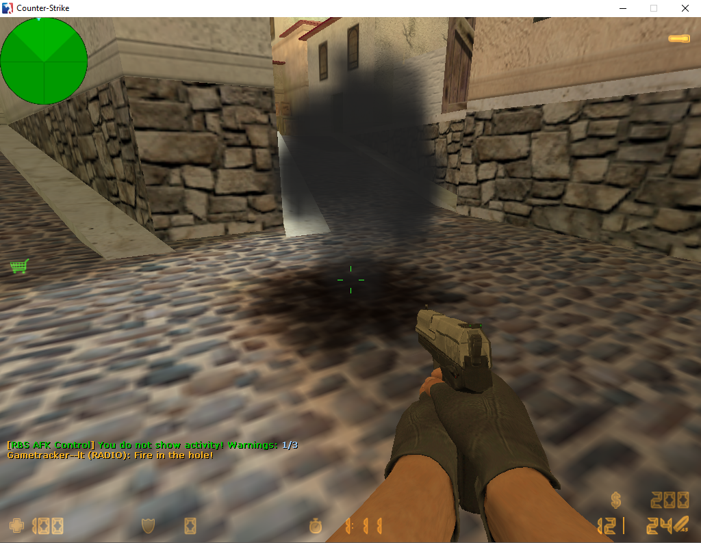
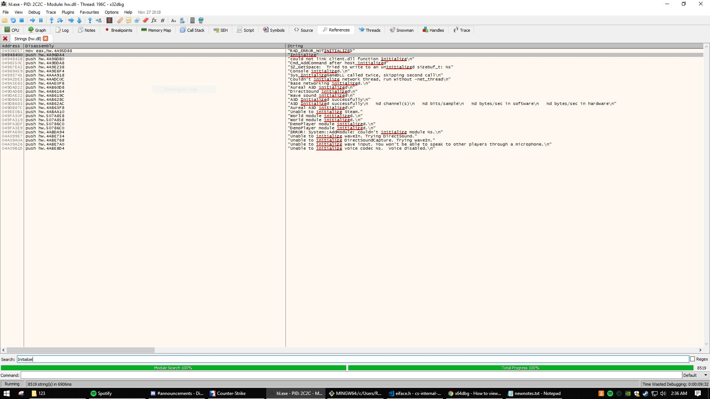
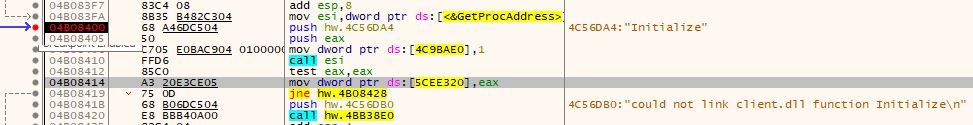
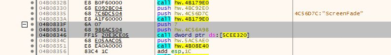
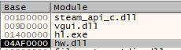
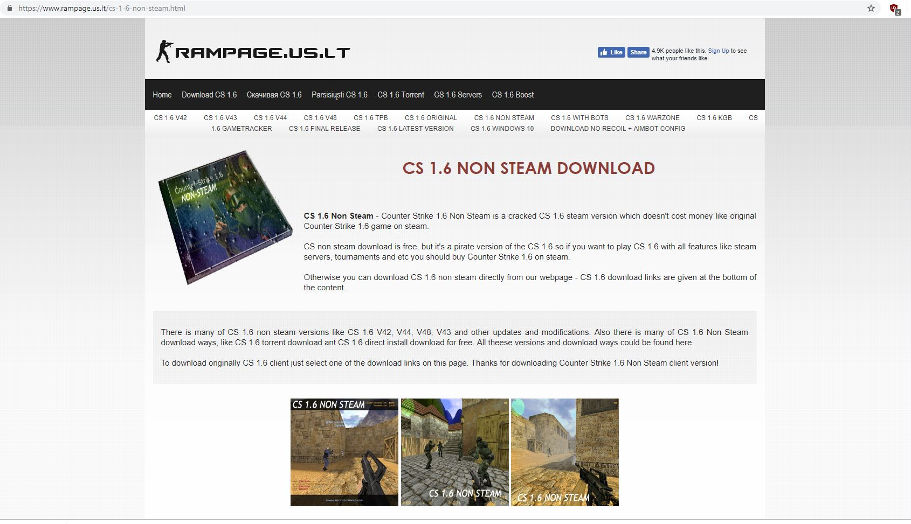
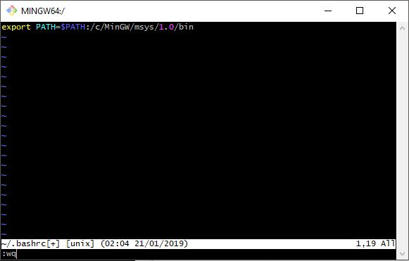
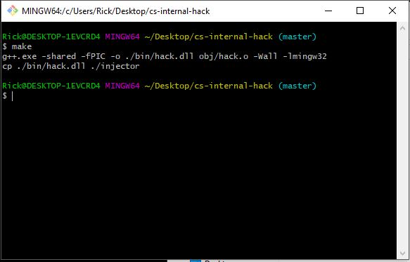
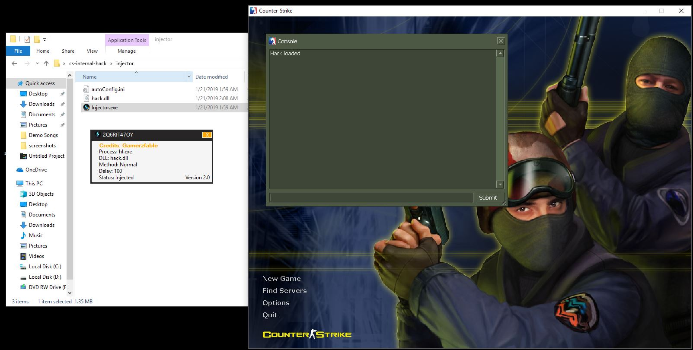

+++
date = '2019-01-21T08:54:34.000Z'
draft = false
title = 'Counter-Strike 1.6 Hacking'
summary = 'Learning how to hack CS 1.6'
+++

## Introduction

After trying and failing to hack this game on and off for almost 15 years (I started playing young), I finally had enough background in C, assembly, and operating systems to pull it off. I did some reading and then wrote an internal hack with some help from forum posts on unknowncheats.me.

This is what final result looks like:



It’s only a no-flashbang hack, but all of the dirty work is done. It wouldn’t be too hard to extend the hack into something like a wallhack or an aimbot.

Here’s how it works and how to extend it.

## Background

An internal hack is made of two parts:

- The injector
- The DLL file (.so on linux)

The injector is a program that allocates space in the target process (the game) and then calls the win32 api `CreateRemoteThread` function to start execution of the DLL file. The DLL then has access to all the game’s memory and can do whatever you want it to do granted you know how to do it.

Luckily, Valve released the source code (called the sdk) to Half-Life which CS is a mod of. So we can take a look around there for hints.

In the source code there’s a function called `Initialize` that takes in a pointer to `cl_enginefunc_t`.

```C
int CL_DLLEXPORT Initialize( cl_enginefunc_t *pEnginefuncs, int iVersion )
{
        gEngfuncs = *pEnginefuncs;

//      RecClInitialize(pEnginefuncs, iVersion);

        if (iVersion != CLDLL_INTERFACE_VERSION)
                return 0;

        memcpy(&gEngfuncs, pEnginefuncs, sizeof(cl_enginefunc_t));

        EV_HookEvents();
        CL_LoadParticleMan();

        // get tracker interface, if any
        return 1;
}
```

Great–what is `cl_enginefunc_t`?

Doing a quick search in the sdk comes up with:

```C
// Pointers to the exported engine functions themselves
typedef struct cl_enginefuncs_s
{
	pfnEngSrc_pfnSPR_Load_t					pfnSPR_Load;
	pfnEngSrc_pfnSPR_Frames_t				pfnSPR_Frames;
	pfnEngSrc_pfnSPR_Height_t				pfnSPR_Height;
	pfnEngSrc_GetWindowCenterX_t			GetWindowCenterX;
	pfnEngSrc_GetWindowCenterY_t			GetWindowCenterY;
	pfnEngSrc_GetViewAngles_t				GetViewAngles;
	pfnEngSrc_SetViewAngles_t				SetViewAngles;
	pfnEngSrc_GetMaxClients_t				GetMaxClients;
	pfnEngSrc_Cvar_SetValue_t				Cvar_SetValue;
	pfnEngSrc_Cmd_Argc_t					Cmd_Argc;
	pfnEngSrc_Cmd_Argv_t					Cmd_Argv;
	pfnEngSrc_Con_Printf_t					Con_Printf;
	pfnEngSrc_Con_DPrintf_t					Con_DPrintf;
	pfnEngSrc_Con_NPrintf_t					Con_NPrintf;
	pfnEngSrc_Con_NXPrintf_t				Con_NXPrintf;
	pfnEngSrc_PhysInfo_ValueForKey_t		PhysInfo_ValueForKey;
	pfnEngSrc_ServerInfo_ValueForKey_t		ServerInfo_ValueForKey;
	pfnEngSrc_GetClientMaxspeed_t			GetClientMaxspeed;
	pfnEngSrc_CheckParm_t					CheckParm;
	pfnEngSrc_Key_Event_t					Key_Event;
	pfnEngSrc_GetMousePosition_t			GetMousePosition;
	pfnEngSrc_IsNoClipping_t				IsNoClipping;
	pfnEngSrc_GetLocalPlayer_t				GetLocalPlayer;
	pfnEngSrc_GetViewModel_t				GetViewModel;
	pfnEngSrc_GetEntityByIndex_t			GetEntityByIndex;
	pfnEngSrc_pfnGetLevelName_t				pfnGetLevelName;
	pfnEngSrc_pfnGetScreenFade_t			pfnGetScreenFade;
	pfnEngSrc_pfnSetScreenFade_t			pfnSetScreenFade;
	pfnEngSrc_VGui_GetPanel_t				VGui_GetPanel;
	pfnEngSrc_pfnServerCmdUnreliable_t		pfnServerCmdUnreliable;
	pfnEngSrc_GetMousePos_t					pfnGetMousePos;
	pfnEngSrc_SetMousePos_t					pfnSetMousePos;
	pfnEngSrc_SetMouseEnable_t				pfnSetMouseEnable;
	...
	...
	...
	// And a lot more
} cl_enginefunc_t;
```

This is the game’s engine function table.

If we can find where the `Initialize` function is in memory with a debugger, we can actually use this struct in our dll by reading the function’s parameters as they’re passed, and then creating our own `cl_enginefunc_t` pointer and setting it to the address we find.

This is super important because it means we have a way to call these game engine functions–functions like `Con_Printf` and `pfnSetScreenFade` which I used to make the no flash hack–inside the dll which we inject.

## Finding the address of the engine function table

Doing the debugging to actually find the engine function table is the real legwork. I use x64dbg instead of OllyDbg because it’s just a tiny bit more colorful and has a decompiler option to convert assembly instructions to C code. I also like the “Time wasted debugging” feature that counts how long you’ve spent debugging the program.

After reading some forum posts on unknowncheats.me, I found a guide that spells everything out.

So, what needs to be done, in order, is:

### Search for the string “Initialize”

Use the references tab and search for Initialize in hw.dll



### Dissect what’s going on



1. The address of `GetProcAddress` is moved into esi and then called

`GetProcAddress` takes in a module and a string which is the name of a function that you want it to return the address of. In this case, hw.dll wants the `Initialize` function that’s exported from client.dll.

2. `test eax, eax`

If it can’t find it, it prints “could not link client.dll function Initialize”. If it found it, it moves the result from `eax` (Remember: return values are put into eax) into a place in memory.

Awesome, that’s the address of `Initialize`. Now we need to find where `Initialize` is used so we can see its parameters being passed and therefore find the engine function table. Luckily, with its address doing this is easy.

### Find references to the address of Initialize

Right clicking the address and hitting “search for references to selected address” gives a few results, but luckily the first one is the one we need. Double-clicking on it gives us this:



By default, arguments are passed via the stack in reverse order. The highlighted section shows the version (`7`) first being pushed, then the address to the engine function table being pushed next (`hw.4C56A98`).

THIS is the money right here. Address 0x4C56A98 is the relative address of the engine function table.

All that needs to be done is to find a way to reference this address in the dll we write. In other words, we have to find an absolute address.

### Relative vs. absolute addresses

An absolute address is an address that won’t change the next time we run the game. The above address will change with each run because it really takes the form of
hw.dll+engfunc_table_offset.

When the game runs, the operating system first loads the executable and then loads each .dll file that the game requires. The spot in memory where they get put isn’t the same every time–it’s up to the OS. The catch is that all the code and data structures inside of each dll will stay the same distance away from the assigned base in memory. So the “offset” won’t change unless the game developers recompile the game with changes to the code.

The solution is to get the base address of hw.dll through x64dbg. Then we can calculate the offset.

### Calculating the offset

We can find the base address of hw.dll by looking at the symbols tab in x64dbg:



The base of hw.dll is 0x04AF0000.

The offset to the game engine function table from hw.dll (the module where it lives) is:

`0x4C56A98 (address we found) - 0x04AF0000 (base of hw.dll) = 0x00166A98`

and voila! All we need to do then is use `GetModuleHandle` to find the base of `hw.dll` when the game runs and then add this number to it and then we’ll have a working pointer to the game engine function table.

## Code for the DLL

```C
#include "SDK.h"

cl_enginefunc_t *pEnginefuncs = NULL;
cl_enginefunc_t gEngfuncs;

void Thread(void)
{
    DWORD dwHWDLL = (DWORD)GetModuleHandle("hw.dll");

    if(!dwHWDLL) {
        MessageBox(NULL, "Cant find hw.dll", "Cant find hw.dll", MB_OK);
    }

    /*
https://www.unknowncheats.me/forum/counterstrike-1-5-1-6-and-mods/125661-cs1-6-finding-offsets.html
0494833F | 6A 07                    | push 0x7                                                   |
04948341 | 68 986AA904              | push hw.4A96A98                                            |
04948346 | FF15 20E3B205            | call dword ptr ds:[<&Initialize>]                          |
        0x00166A98 (offset of engine) = 0x4A96A98 - hw.dll base (0x04930000)
    */
    pEnginefuncs = (cl_enginefunc_t*)(dwHWDLL + 0x00166A98); // first argument of dllexport Initialize in client.dll
    memcpy(&gEngfuncs, pEnginefuncs, sizeof(cl_enginefunc_t));

    gEngfuncs.Con_Printf("Hack loaded\n");

    while(true)
    {
        //cl_entity_t *player = gEngfuncs.GetLocalPlayer();
        //gEngfuncs.Con_Printf("x: %f y: %f z: %f\n", player->origin[0], player->origin[1], player->origin[2]);


        // No flash
        screenfade_t fade;
        gEngfuncs.pfnGetScreenFade(&fade);

        if(fade.fadealpha > 0) {
            fade.fadealpha = 30; // set to 30 but for some reason it gets rid of the flash entirely.. i'm not complaining
            gEngfuncs.pfnSetScreenFade(&fade);
        }
    }
}


BOOL WINAPI DllMain(HINSTANCE hinstDLL, DWORD fdwReason, LPVOID lpvReserved)
{
    switch(fdwReason)
    {
    case DLL_PROCESS_ATTACH:

        CreateThread(NULL,NULL,(LPTHREAD_START_ROUTINE)Thread,NULL,NULL,NULL);
        //MessageBox(NULL, "Hack.dll: injected", "Injection", MB_OK);

        break;
    }

    return true;
}
```

## How to run the code

The full code is on my Github [here](https://github.com/nsarka/cs-internal-hack).

I used a non-steam version of CS 1.6. Shameful, I know. I just don’t want any hacking tools anywhere near my 15 year old steam account. I do NOT want to get vac banned (oh yeah, this hack is definitely detected).



You can download a copy [here](https://www.rampage.us.lt/cs-1-6-non-steam.html).

I also used [MinGW](http://www.mingw.org/) and [Git SCM](http://git-scm.com/) for the C++ compiler and linux command-line on Windows, respectively.

The steps are:

1. Download MinGW, run the setup and get all of the basic stuff
2. Download Git SCM for the command line
3. Add your msys mingw folder to your path on the command line



4. Clone the full code: `git clone https://github.com/nsarka/cs-internal-hack.git`
5. Run `cd cs-internal-hack`
6. Run `make`



7. Run the game, then go into the injector folder and run the injector as administrator

If it worked, you should see “Hack Loaded” print into the console.



## Extending the hack

At this point it shouldn’t be too bad. You can take a look at the actual `cl_enginefunc_t` struct to see what engine functions are available to you, and if that isn’t enough you can also use this same method to find some other function table structures. There is the export table, the studio and the interface. Read about how to find them [here](https://www.unknowncheats.me/forum/counterstrike-1-5-1-6-and-mods/125661-cs1-6-finding-offsets.html).

## Conclusion

I can’t say that was all my original work–far from it. The people at unknowncheats.me have been doing this for years so I have to thank them for posting their findings. Without it this would’ve been a months long ordeal since reverse engineering is the most time consuming part.

It was pretty fun to do this type of research and even more fun to actually get things working. I probably crashed the game 20-30 times trying to get the offsets right.

If anybody is interested or needs help running this my email is [nsarka00@gmail.com](mailto:nsarka00@gmail.com). I’ll reply within a day.
